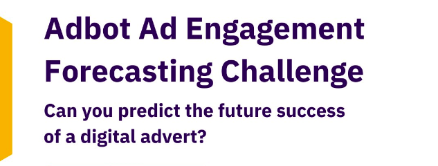
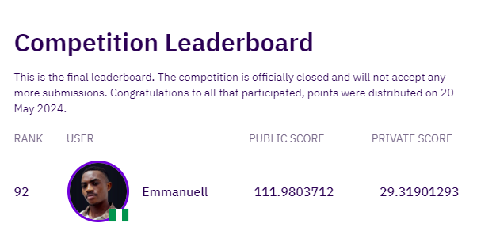
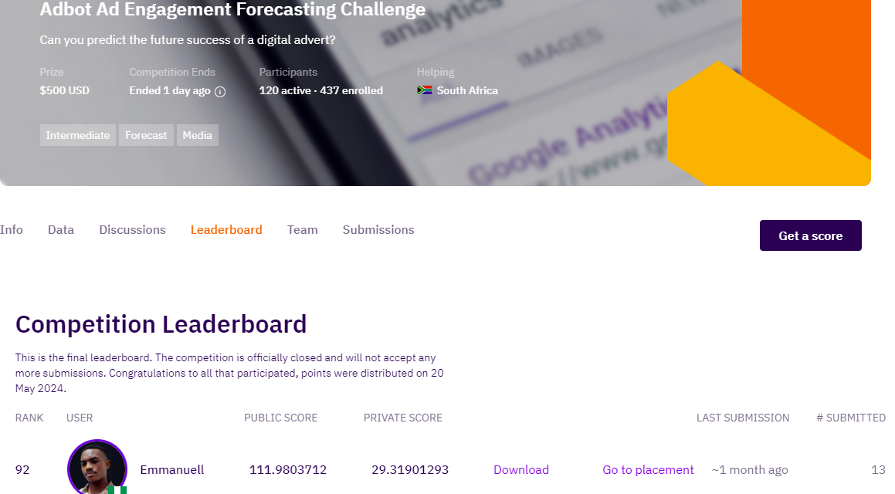

# Adbot Ad Engagement Forecasting

[](https://github.com/ikoghoemmanuell?tab=repositories)
[]()
[](https://emmanuelikogho.netlify.app/)


## Introduction

This repository serves as a case study for the Adbot Click Prediction Challenge for Azubian on Zindi Africa. The challenge focuses on predicting the number of clicks a client's ad receives, one and two weeks into the future. This case study explores the data, methodologies, and models used to tackle the challenge, providing insights into the predictive analytics process.

In a digital ecosystem saturated with advertisements, accurately predicting success is pivotal for businesses. Adbot aims to empower its small business clients with actionable insights to refine their ad campaigns and bolster customer engagement.

## Dataset

The dataset used for this case study is provided on the Zindi Africa platform. It consists of daily ad records for 185 clients from the Adbot platform, including historical data on ad costs, number of impressions, keywords used, and call details. This data is utilized to build models that can accurately forecast future clicks, helping small African businesses optimize their advertising strategies and improve customer engagement.

### Files

- **Train.csv (36.5 MB)**: Contains historical ad performance data used to train the model.
- **SampleSubmission.csv (14.8 KB)**: Shows the submission format for the competition, with columns for client IDs, dates, and forecasted clicks.

### Objective

The objective of this challenge is to accurately predict the number of clicks a client's ad receives, one and two weeks into the future. Winning solutions must also include a description of the variables that had the most significant impact on engagement (number of clicks), ensuring that models are not only accurate but also interpretable.

### Evaluation

The evaluation metric for this competition is Root Mean Squared Error (RMSE). Submission files should contain 7 columns: ID, Target, and the 5 top predictors. For each client, predictions are required for both one week and two weeks into the future.

### About Adbot

Adbot (myadbot.com) empowers small and medium-sized business owners by serving as an ultimate online advertising co-pilot. Its cutting-edge AI automation ensures 24/7 campaign management and optimization across multiple online channels, allowing businesses to achieve more with their ad campaigns.

### Impact

Accurate ad impression and click-through-rate forecasting can revolutionize marketing strategies for small African businesses leveraging the Adbot platform. By providing actionable insights, Adbot empowers clients to optimize their advertising efforts, improving customer engagement and driving business growth.

## Setup

Fork this repository and run the notebook on Colab.

Learn about Google Colab here.
Learn how to connect Colab to your github account here.

## Methodology

1. Exploratory Data Analysis (EDA): The case study begins with an in-depth exploration of the dataset to understand its structure, variables, and patterns. EDA techniques such as data visualization and statistical analysis are applied to gain insights into the sales patterns and relationships between variables.

2. Feature Engineering: The dataset is preprocessed and transformed to create meaningful features that capture relevant information for sales forecasting. This involves tasks such as handling missing values, encoding categorical variables, and creating lagged features to account for time dependencies.

3. Model Development: Various machine learning and time series forecasting models are developed and evaluated to identify the best-performing approach. This may include traditional regression models, ensemble methods, or advanced techniques specifically designed for time series forecasting, such as ARIMA, SARIMA, or Prophet.

4. Model Evaluation: The performance of the developed models is assessed using appropriate evaluation metrics such as Mean Absolute Error (MAE) or Root Mean Squared Error (RMSE). The models are compared based on their predictive accuracy and ability to capture the underlying sales patterns.

5. Forecasting and Visualization: The selected model is used to generate sales forecasts for future time periods. The forecasted results are visualized using graphs and charts to provide actionable insights and aid decision-making for grocery store management.

## Repository Structure

The repository is organized as follows:

- `data/`: Contains the dataset files.
- `notebooks/`: Contains Jupyter notebooks showcasing the step-by-step implementation of the case study, including EDA, feature engineering, model development, and evaluation.
- `dev/`: Contains any source code or scripts used in the case study, such as data preprocessing or custom functions.

Feel free to explore the notebooks and source code to gain a deeper understanding of the case study methodology.

# Contribute

Fork this repository first of all. Now follow the steps below

You need to have [`Python 3`](https://www.python.org/) on your system (**a Python version lower than 3.10**). Then you can clone this repo and being at the repo's `root :: repository_name> ...` follow the steps below:

- Windows:

```python
python -m venv venv; venv\Scripts\activate; python -m pip install -q --upgrade pip; python -m pip install -qr requirements.txt
```

- Linux & MacOs:

```python
python3 -m venv venv; source venv/bin/activate; python -m pip install -q --upgrade pip; python -m pip install -qr requirements.txt
```

The both long command-lines have a same structure, they pipe multiple commands using the symbol `;` but you may manually execute them one after another.

1. **Create the Python's virtual environment** that isolates the required libraries of the project to avoid conflicts;
2. **Activate the Python's virtual environment** so that the Python kernel & libraries will be those of the isolated environment;
3. **Upgrade Pip, the installed libraries/packages manager** to have the up-to-date version that will work correctly;

# My score on Zindi




## 👏 Support

If you found this article helpful, please give it a clap or a star on GitHub!

## Author

- [Emmanuel Ikogho](https://emmanuelikogho.netlify.app/)
